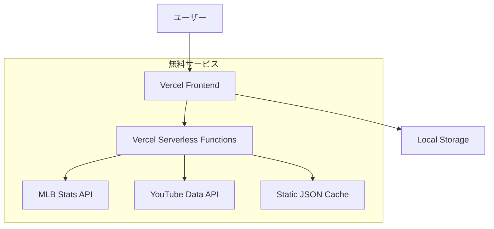

# Design Document

## Overview

MLBの試合結果と概要を日本語で表示するウェブサイトの設計。完全無料のソリューションとして、静的サイトジェネレーター（Next.js）とサーバーレス関数を組み合わせて構築する。データ取得はMLB Stats API、ホスティングはVercel、YouTubeハイライトはYouTube Data APIを使用する。

## Architecture

### システム構成



### 技術スタック

- **フロントエンド**: Next.js 14 (App Router)
- **スタイリング**: Tailwind CSS
- **ホスティング**: Vercel (無料枠)
- **API**: Vercel Serverless Functions
- **データソース**: MLB Stats API (無料)
- **動画**: YouTube Data API v3 (無料枠)
- **キャッシュ**: 静的JSONファイル + Vercel Edge Cache
- **状態管理**: React Context + Local Storage

## Components and Interfaces

### フロントエンドコンポーネント

#### 1. レイアウトコンポーネント
- `Header`: ナビゲーション、得点隠しモード切り替え
- `Footer`: 著作権情報
- `MobileNav`: モバイル専用ナビゲーション

#### 2. 試合表示コンポーネント
- `GameCard`: 個別試合情報表示
- `GameList`: 試合一覧表示
- `GameDetail`: 試合詳細モーダル
- `ScoreDisplay`: 得点表示（隠しモード対応）

#### 3. フィルター・ナビゲーション
- `TeamFilter`: チーム選択フィルター
- `DatePicker`: 日付選択
- `ToggleButton`: 得点隠しモード切り替え

#### 4. メディアコンポーネント
- `YouTubeEmbed`: YouTube動画埋め込み
- `HighlightSection`: ハイライト動画セクション

### APIエンドポイント設計

#### `/api/games/[date]`
- **Method**: GET
- **Parameters**: date (YYYY-MM-DD)
- **Response**: 指定日の試合データ（日本語）
- **Cache**: 24時間

#### `/api/game/[gameId]`
- **Method**: GET  
- **Parameters**: gameId
- **Response**: 試合詳細データ（日本語）
- **Cache**: 試合終了後は永続、進行中は5分

#### `/api/highlights/[gameId]`
- **Method**: GET
- **Parameters**: gameId
- **Response**: YouTube動画リンク
- **Cache**: 24時間

#### `/api/teams`
- **Method**: GET
- **Response**: チーム一覧（日本語名付き）
- **Cache**: 7日間

## Data Models

### Game Model
```typescript
interface Game {
  gameId: string;
  date: string;
  homeTeam: Team;
  awayTeam: Team;
  homeScore: number;
  awayScore: number;
  status: 'scheduled' | 'live' | 'final';
  inning?: number;
  inningHalf?: 'top' | 'bottom';
  summary: string; // 日本語概要
  highlights?: string[]; // YouTube動画ID
}
```

### Team Model
```typescript
interface Team {
  id: number;
  name: string; // 英語名
  nameJa: string; // 日本語名
  abbreviation: string;
  logo: string;
  primaryColor: string;
}
```

### GameDetail Model
```typescript
interface GameDetail extends Game {
  lineScore: InningScore[];
  battingStats: BattingStats[];
  pitchingStats: PitchingStats[];
  keyPlays: KeyPlay[];
}

interface KeyPlay {
  inning: number;
  description: string; // 日本語
  playType: string;
}
```

## Error Handling

### API エラーハンドリング
1. **MLB API障害**: キャッシュされたデータを表示
2. **YouTube API制限**: 「動画準備中」メッセージ
3. **ネットワークエラー**: リトライ機構（3回まで）
4. **データ不整合**: フォールバック表示

### フロントエンドエラーハンドリング
1. **コンポーネントエラー**: Error Boundary
2. **データ読み込み失敗**: スケルトンローダー継続表示
3. **画像読み込み失敗**: デフォルト画像表示

## Testing Strategy

### 単体テスト
- **コンポーネント**: React Testing Library
- **API関数**: Jest
- **ユーティリティ関数**: Jest

### 統合テスト
- **API エンドポイント**: Supertest
- **ページ遷移**: Playwright

### E2Eテスト
- **主要ユーザーフロー**: Playwright
- **モバイル対応**: デバイスエミュレーション
- **得点隠しモード**: 機能テスト

### パフォーマンステスト
- **Lighthouse CI**: 自動パフォーマンス測定
- **Core Web Vitals**: 継続監視

## 日本語化戦略

### 静的翻訳データ
- チーム名、ポジション名の日本語対応表を作成
- 野球用語辞書（JSON形式）を準備
- 試合状況の定型文テンプレート

### 動的翻訳
- 簡単な文章構築ロジック
- プレイ内容の日本語変換関数
- 数値・時間の日本語フォーマット

## キャッシュ戦略

### 多層キャッシュ
1. **Vercel Edge Cache**: API レスポンス
2. **Static Generation**: 過去の試合データ
3. **Browser Cache**: 画像、CSS、JS
4. **Local Storage**: ユーザー設定

### キャッシュ無効化
- 試合終了時: 該当試合データ
- 日次: 当日試合データ
- 週次: チーム情報

## モバイル最適化

### レスポンシブデザイン
- **Breakpoints**: 
  - Mobile: < 768px
  - Tablet: 768px - 1024px  
  - Desktop: > 1024px

### タッチ操作
- **最小タッチターゲット**: 44px × 44px
- **スワイプナビゲーション**: 日付・チーム切り替え
- **プルトゥリフレッシュ**: データ更新

### パフォーマンス
- **画像最適化**: Next.js Image コンポーネント
- **遅延読み込み**: 試合詳細データ
- **プリフェッチ**: 翌日の試合データ

## セキュリティ考慮事項

### API セキュリティ
- **レート制限**: API呼び出し頻度制御
- **CORS設定**: 適切なオリジン制限
- **APIキー保護**: 環境変数での管理

### フロントエンドセキュリティ
- **XSS対策**: データサニタイゼーション
- **CSP設定**: Content Security Policy
- **HTTPS強制**: Vercelデフォルト設定